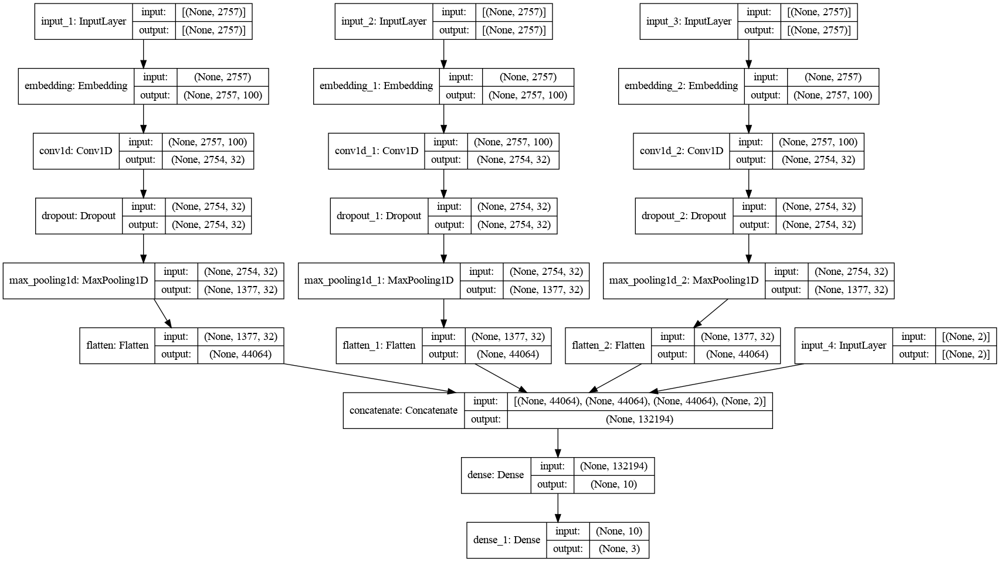
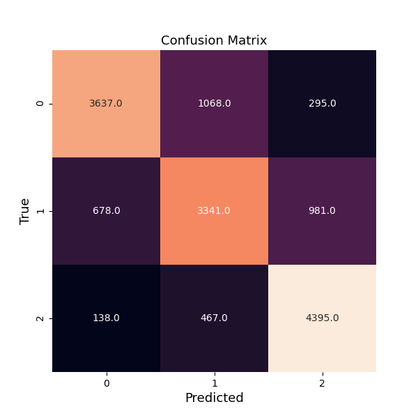

# Stackoverflow Question Label Prediction


## A) Project Requiremnet

Stakoverflow is an widely used question answeres forum website that helps millions of users worldwide. But because of wide range of user base monitoring quality of the questions posted by the users becomes important. For example, when someone asks a question how to solve data science porblem? it becomes difficult for domain experts to answer the question when sufficient problem description is unavailble. Whereas when somebuddy asks how to solve multiclass text classification problem using logistic regression? it becomes much convenient for experts to answer the question.
In this project we tried to solve a such problem using the data set provided by [Moore](https://www.kaggle.com/imoore) on [Kaggle](https://www.kaggle.com/imoore/60k-stack-overflow-questions-with-quality-rate)

## B) Web app preview


### Please visit the app by clicking on the link below
[Stackoverflow text classification app](https://text-label-prediction.herokuapp.com/)

## C) File directory
```bash
.
├── app.png
├── app.py
├── cnn.png
├── confusion_matrix.png
├── input
│   ├── archive
│   │   ├── test.csv
│   │   └── train.csv
│   ├── test.csv
│   ├── test_dev.csv
│   ├── train.csv
│   └── train_dev.csv
├── models
│   ├── cnn.h5
│   └── keras_tokenizer.pkl
├── nltk.txt
├── Procfile
├── README.md
├── requirements.txt
├── sample.docx
├── src
│   ├── check.py
│   ├── create_folds.py
│   ├── dataframe.py
│   ├── __pycache__
│   │   ├── dataframe.cpython-38.pyc
│   │   └── train.cpython-38.pyc
│   └── train.py
├── stackoverflow.png
├── static
│   └── css
│       └── style.css
└── templates
    └── index.html

```

## D) Problem Introduction:<br>
The problem we are trying to solve is a *multi-class classification* problem.<br>
Classes:
<ul>
  <li>HQ: High Quality Question</li>
  <li>LQ_CLOSE: Low Quality Question Closed</li>
  <li>LQ_EDIT: Low Quality Question Edited</li>
</ul>

Raw data set columns:
<ul>
  <li>Id</li>
  <li>Title</li>
  <li>Body</li>
  <li>Tags</li>
  <li>Creation Date</li>
</ul>

Hence, this is a *text multi-class classification* problem.

## E) Project Directories:
<ul>
    <li>input: Contains all iteration of input data including train and test data sets.</li>
    <li>models: Contains all the necessary models developed over the project cycle.</li>
    <li>src: Contains all .py script files.</li>
    <li>static: Contains all css files</li>
    <li>templates: Contains all .html files</li>
    <li>root directory: Contains all the above mentioned directories along with app.py, nltk.txt, Procfile, requirenment.txt, etc.</li>
</ul>

## F) Project Description:

This project is built in three different stages:
<ol>
    <li>Data Preparation</li>
    <li>Mdel building</li>
    <li>Building a web application</li>
</ol>

### F.1 Data Preparation:
The data at hand contain three important features of information:
<ul>
    <li>Title</li>
    <li>Body</li>
    <li>Tags</li>
</ul>

Since, this is an ongoing project, right now we will focus on the "Body" feature of any question. Because "Body" of a question is most informative about quality of the question selecting "Body" feature is an obvious choice. Body of a question contains detail problem explanation followed by a title. In addition to this text explaination Body may also contain other sources of informations such as code examples, script snippets, images, or external reference links. The data provided is in html format which allows us to make use of excelent library called BeautifulSoup to extract different informations from the html data.<br>

For initial data preparation we seperate out text of a question from other html nuances. This text serves as a corpus for the iteration of the project. But in addition to this throwing away text, script data will give away lot of information at the same modeling coding snippets at this stageis difficult. Therefore we make a list of records that tells if a question contains code or script or not. <br>

Now, most of the text cleaning steps are performed in the script called dataframe.py from src folder. This script takes in raw data files and output very neat looking dataframe files with the file names ending "_dev.py". In this file we do nothing but seperating body text from other html body stuff and remove any trailing blank spaces from these texts. We then perform decontraction on the contracted words (For example, mapping don't to do not, etc.) and make all of the words in text lowercase. As we mentioned earlier, we will keep track of code and script snippets. Due to some reasons I had to perform rest of the text cleaning steps in the train.py script.<br>

In the train.py script we remove all punctuation marks or alpha-numeric words. In case of empty string results we fill word "None" in the text. Once we are done with data cleaning (preparation) we move forward building the CNN model.

### F.2) Model building:
I got great help from  for this project. Please check out his blog post!<br><br>
Here, we are building 1D Convolutional Neural Network model. Neural Network (or any machine learning model in general) do not understand only numeric data. To convert text data to numeric one, we first have to tokenize our text corpus. For this we make use of the keras Tokenizer with only 999 most freuent words. Tokenizer maps 999 most frequent words from the corpus to a vocabulary index number. Because, not all body texts of the questions have equal length we find longest body text sample to pad all other samples (with zeros) to create all sentences of equal lengths.<br>


<b>Concept:</b><br>
The concept behind building this 1-dimensional 4 channeled CNN architechture is that model CNN will learn text sequences updaing word embedding initialized by the embedding layer. Our model takes in 4 different inputs. The first layer in every channel is input layer. Three channels uses embedding layers to initialize word embeddings (word representation of d dimmension, here 100). Each of these three layers then perform convolution and max pooling operations to then later flatten out the outputs. These flatten outputs are then concatenated together along with the fourth input as a vector 2 dimmensional to form a dense layer. This densely connected layer then outputs 3 dimmensional vector indicating class probability values for the prediction.

<b>Inputs:</b><br>
Our model contains 4 inputs, where input1, input2, and input3 are padded sequences of body texts. The input4 is a 2 dimmensional vector indicating if a sample contains code or script (code_indicator, script_indicator).

### F.3) Building a web application:
Building a web application is quite easy with Flask framework once the model is pre-trained. The static and templates folder are for css, javascript, and html files, but the main script is app.py. Here, we can input data from out our user interface. Once the data is available inside the function we perform same set of steps on this newly arrived data. Once this data is preprocessed and ready to go into the model we use our pre-trained model trained in train.py script to make prediction. At last we output our result on the result page of the application.

## G) Model Performance:
The model performance is calculated based on the accuracy of the prediction. Where as on test set model accuracy is 75.82% and the confusion matrix is as shown below.


## F) Model Deployment:
We used Heroku Cloud Platform to delpy our model. It is easy to use and free for hosting small web applications like this. For hosting on Heroku we must have requirements.txt and Procfile. This  is a great help for building Flask web application. Please visit his blog post.

## Thank you visting!
